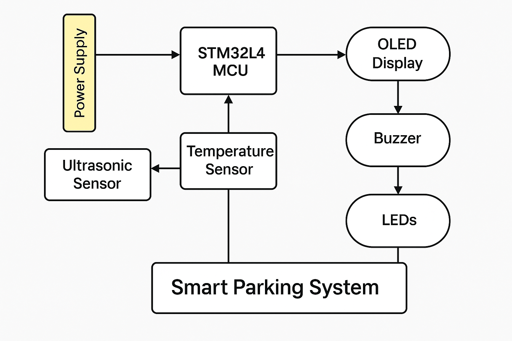
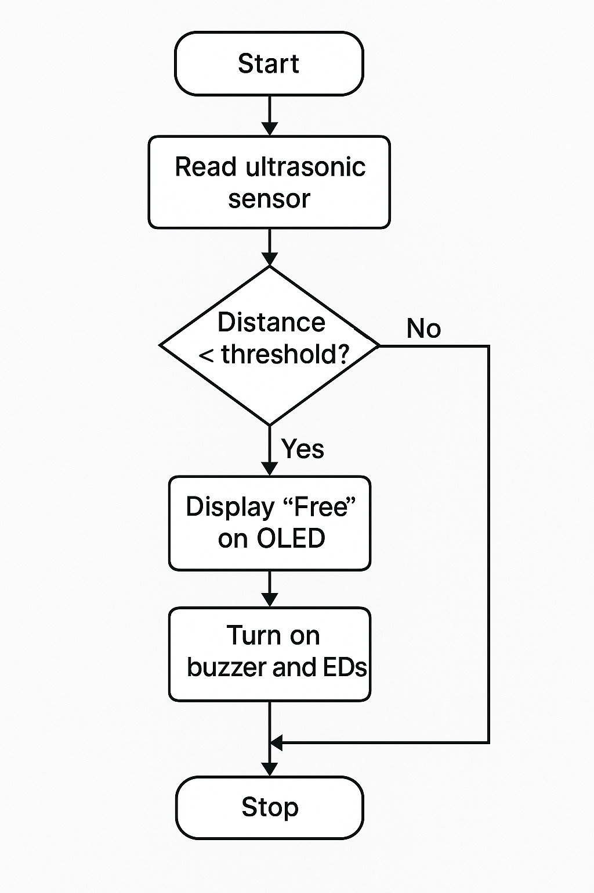
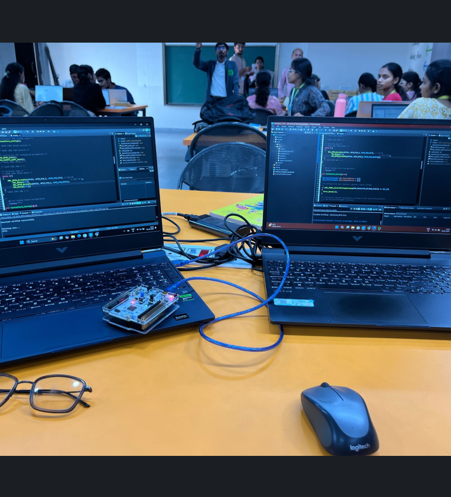

# 🚗 Smart Parking System  
### IoT-Based Vehicle Counting and Fire Detection using STM32L476RG

---

## 📘 Overview
The **Smart Parking System** is an IoT-based solution built on the **STM32L476RG microcontroller**, designed to monitor parking-lot occupancy, detect fire hazards, and display live status updates.  
It improves both **safety** and **parking-space utilization** through automated sensing and feedback.

---

## Architecture

## 🧱 System Block Diagram

## 🔄 Logic Flowchart

## 📸 Project Build and Testing

## ⚙️ Features
- 🚗 **Automatic Vehicle Counting** – Ultrasonic sensors detect entry and exit.  
- 🖥️ **Real-time OLED Display** – Shows current availability and system alerts.  
- 🔥 **Fire Detection** – Temperature sensor triggers alarm on high heat.  
- 🔊 **Buzzer + LEDs** – Alert signals for fire or full-capacity events.  
- 🔋 **Energy Efficient** – Powered by STM32L4’s low-power architecture.  
- 🧠 **Smart Messages:**
  - “Can come more” (< 15 cars)  
  - “Only few” (< 30 cars)  
  - “Stop, no place” (≥ 50 cars)

---
---

## 🧩 Components Used
| Component | Description |
|------------|-------------|
| STM32L476RG | Main MCU – handles sensors and display |
| Ultrasonic Sensor | Vehicle entry/exit detection |
| Temperature Sensor | Fire and heat monitoring |
| OLED Display | Shows slot status and warnings |
| Buzzer & LEDs | Visual and audible alerts |
| Power Supply | 5 V DC regulated |
| Jumper Wires | Connections and interfacing |

---

## ⚙️ Working Principle
- The **ultrasonic sensor** detects vehicles at entry/exit gates.  
- Vehicle count is incremented or decremented accordingly.  
- The **OLED display** shows the current count and smart messages.  
- The **temperature sensor** continuously monitors for high heat.  
- When the threshold is crossed, a **fire alert** is activated via buzzer and display warning.

---

## 🔧 Firmware Overview
- Written in **C (HAL/LL drivers)** using **STM32CubeIDE**  
- Core modules:
  - `main.c` – initialization and main loop  
  - `vehicle_count.c` – ultrasonic sensor logic  
  - `display.c` – OLED I²C interface  
  - `fire_alert.c` – temperature sensing and alarm control
  - 

  ---

## 📸 Project Demo & Results

<table>
<tr>
<td align="center">
   
  <b>Development Setup — STM32 Programming</b>
</td>
<td align="center">
   
  <b>System Architecture Overview</b>
</td>
</tr>
<tr>
<td align="center">
   
  <b>System Logic Flow</b>
</td>
<td align="center">
   
  <b>Testing Phase — OLED & Sensor Integration</b>
</td>
</tr>
</table>

---

## 🧪 Key Observations
- Counting accuracy: **98%+** in controlled testing.  
- Fire alert threshold: **Triggered at 45°C.**  
- OLED messages update dynamically every second.  
- System power draw: **< 80 mA average.**

---

## 📸 Circuit Diagram & Setup
| Prototype | Circuit Diagram |
|:----------:|:----------------:|
## 🚀 Future Scope
- 📱 Integration with smartphone parking apps  
- ☁️ Cloud-based data logging of vehicle flow  
- 🔋 Solar-powered, wireless sensor nodes  

---

## 🧰 Tools & Software
- STM32CubeIDE  
- Proteus / TinkerCAD (simulation)  
- OLED I²C Library  
- HAL/LL Peripheral Drivers  
